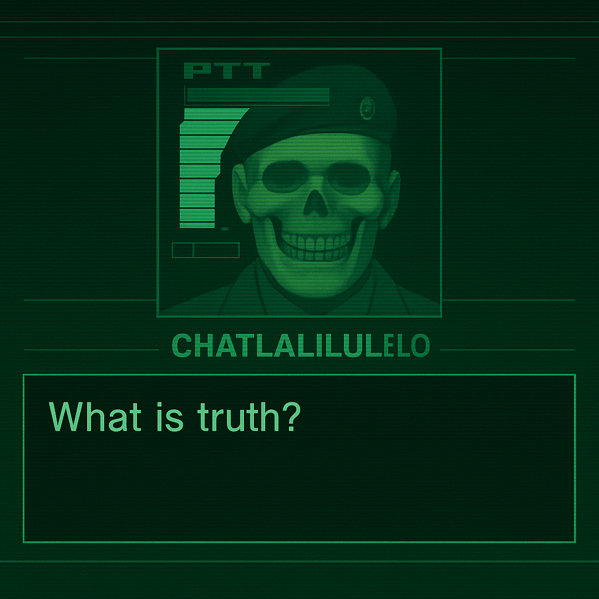

# ChatLaLiLuLeLo

A Codec-style AI companion for philosophy, dry humour, Bitcoin discussion, and MGS nostalgia.

**[Open the hosted Codec →](https://johndtwaldron.github.io/ChatLaLiLuLeLo/)**

[](https://github.com/johndtwaldron/ChatLaLiLuLeLo/actions/workflows/ci.yml)



## The experience

Two portraits, a frequency display, streaming subtitles, and a phosphor-green interface. Switch the conversation mode, cycle portraits and themes, toggle CRT effects, or play voice replies when voice is configured.

- **Streaming chat** through a Cloudflare Worker and OpenAI.
- **Codec atmosphere** with scanlines, portrait animation, sound effects, and waveform feedback.
- **Voice controls** with configurable TTS, playback volume, and error feedback.
- **Transcript export** for saving conversations.
- **Bitcoin mode** with a Lightning donation QR code.
- **Web and mobile layouts** built with Expo and React Native. Native release plans are separate from the hosted web app.

The hosted interface may be available even when an AI or voice provider is unavailable. Live replies depend on backend configuration, credentials, and provider quotas.

## Conversation modes

| Mode | Character |
| --- | --- |
| **JD — Colonel AI** | Philosophical challenges about identity, agency, and information control. |
| **BTC — Orange Pill** | Bitcoin, monetary sovereignty, and self-custody themes. |
| **GW — Haywire** | Glitchy, surreal conversation with the Colonel's underlying voice. |
| **MGS — Lore** | MGS themes, media theory, and digital culture. |
| **RICK — Bogart** | Restrained noir advice, a monochrome theme, and rotating portraits and quotes. Available on `dev-plus`. |

`main` is the default repository branch. `dev-plus` contains the newer Rick implementation and briefs for additional modes. A mode brief describes an idea; it does not mean the mode is implemented.

## Run locally

Use Node.js 18+ and npm 8+; the GitHub Actions workflows use Node.js 20.

```bash
git clone https://github.com/johndtwaldron/ChatLaLiLuLeLo.git
cd ChatLaLiLuLeLo

# Use the latest development version, including Rick.
git switch dev-plus
npm ci

# Create your private backend configuration.
cp apps/edge/.dev.vars.example apps/edge/.dev.vars
# Edit apps/edge/.dev.vars with your own API keys.

npm run dev
```

| Service | Local address |
| --- | --- |
| Frontend | http://localhost:14085 |
| Backend | http://localhost:8787 |
| Backend health | http://localhost:8787/health |

On `dev-plus`, `npm run dev` first runs `scripts/sync-env.sh`, then the development launcher. The sync script generates `apps/mobile/.env` from `apps/edge/.dev.vars`; it replaces that frontend file. Mock voice mode is available through `ELEVENLABS_MODE=mock`.

Keep real credentials out of Git. Variables prefixed with `EXPO_PUBLIC_` are available to the client, so they must not be treated as private server secrets.

## Useful commands

Run these from the repository root:

| Command | Purpose |
| --- | --- |
| `npm run dev` | Start development with validation. |
| `npm run prod` | Start local frontend and backend directly. |
| `npm run typecheck` | Check frontend TypeScript. |
| `npm run typecheck --workspace=chatlalilulelo-edge` | Check backend TypeScript. |
| `npm run lint` | Lint the mobile/web app. |
| `npm test` | Run the app's Jest tests. |
| `npm run ci-check` | Run the local CI checks. |
| `npm run e2e:web` | Run the Playwright web tests. |
| `npm run e2e:lightning` | Run the Lightning integration tests. |

To export the web app:

```bash
cd apps/mobile
npm run export:web
```

See [DEVELOPMENT.md](DEVELOPMENT.md) for the development workflow and [Tests of the LaLiLuLeLo](Tests_of_the_LaLiLuLeLo.md) for the testing reference. Historical documents may describe older branches or commands; check `package.json` before using them.

## Project layout

```text
apps/mobile/       Expo app, Codec UI, voice playback, and bundled assets
apps/edge/         Cloudflare Worker, chat API, prompts, and validation
prompts/modes/     Persona source documents
material/          Source images, audio, and transcripts
scripts/           Development, validation, and deployment helpers
tests/             API and browser integration tests
docs/              Specifications, guides, and development history
.github/workflows/ GitHub Actions configuration
```

The app consumes assets from `apps/mobile/assets/`; `material/` is the source collection. Backend system prompts are embedded in `apps/edge/lib/composer.ts`, so editing a Markdown persona file alone does not update runtime behaviour.

## Hosting and repository activity

- **Frontend:** [GitHub Pages](https://johndtwaldron.github.io/ChatLaLiLuLeLo/), built by the [Pages workflow](https://github.com/johndtwaldron/ChatLaLiLuLeLo/actions/workflows/pages.yml).
- **Backend:** Cloudflare Workers. Deployment configuration is branch-specific; on `dev-plus`, the backend workflow is manually triggered.
- **Checks:** [GitHub Actions](https://github.com/johndtwaldron/ChatLaLiLuLeLo/actions) includes CI and security analysis. Scheduled CodeQL runs are security scans, not app deployments.

The Pages workflow can deploy several branches. A manual target branch or the repository's `DEPLOY_BRANCH` variable can override the triggering branch; the default GitHub branch does not necessarily identify the currently hosted version.

## Local files and backups

`.gitignore` excludes private environment files, dependencies, native build folders, ZIP archives, local debug output, Windows batch helpers, and selected MP4 video paths. Those files need a separate backup even when `git status` is clean.

Images and sound clips under the normal asset folders are generally tracked. Optional video commands require local video files that are not bundled in Git.

## Project status

This is a personal project with a working web foundation and ongoing experiments. Additional personas, distinct per-mode voices, voice access controls, narrative memory, and native releases remain development directions rather than promises of shipped features.

The interface draws inspiration from Metal Gear Solid and Casablanca. This is an independent fan project, unaffiliated with their creators or rights holders. The source includes reference media; inclusion does not establish redistribution rights.
